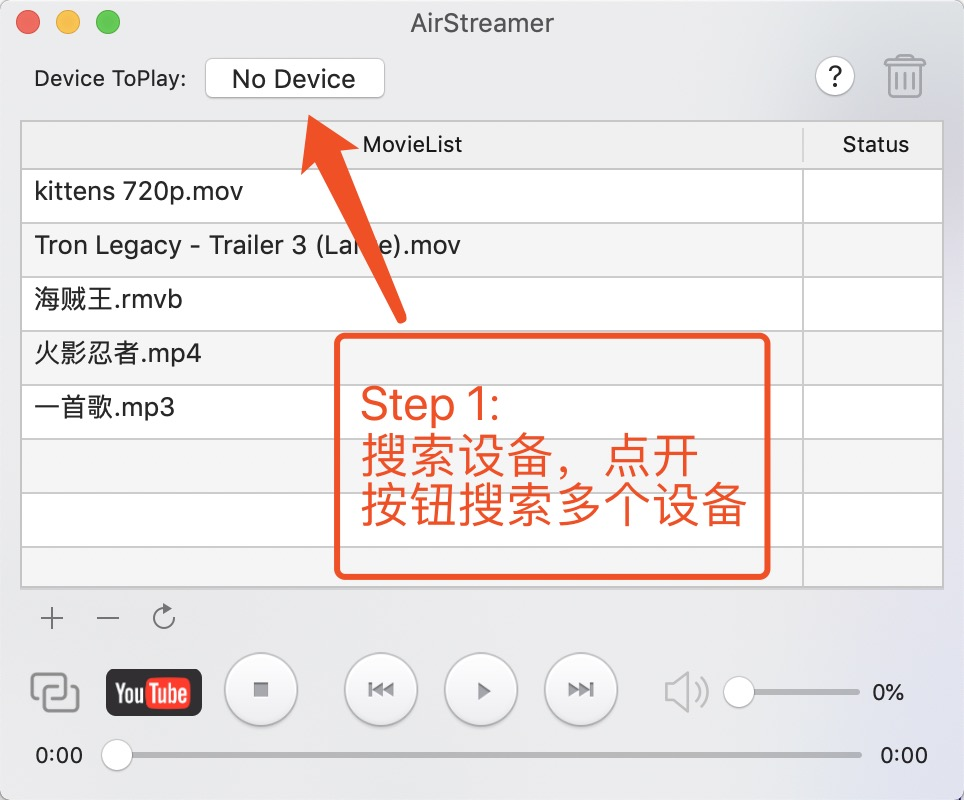
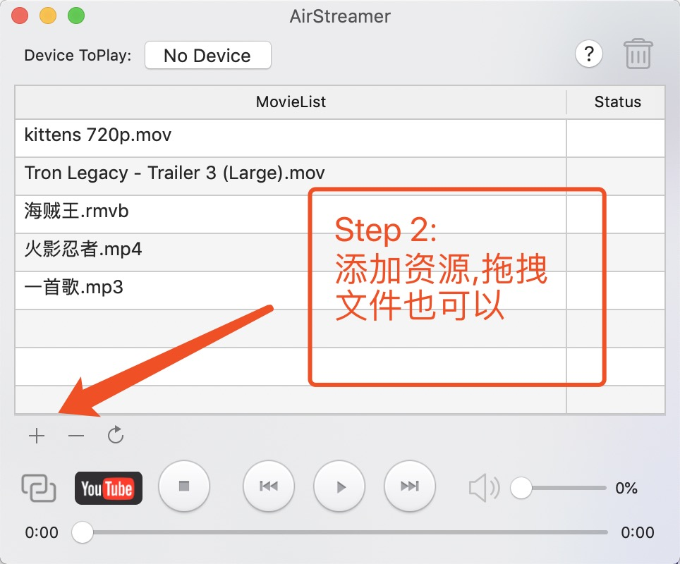
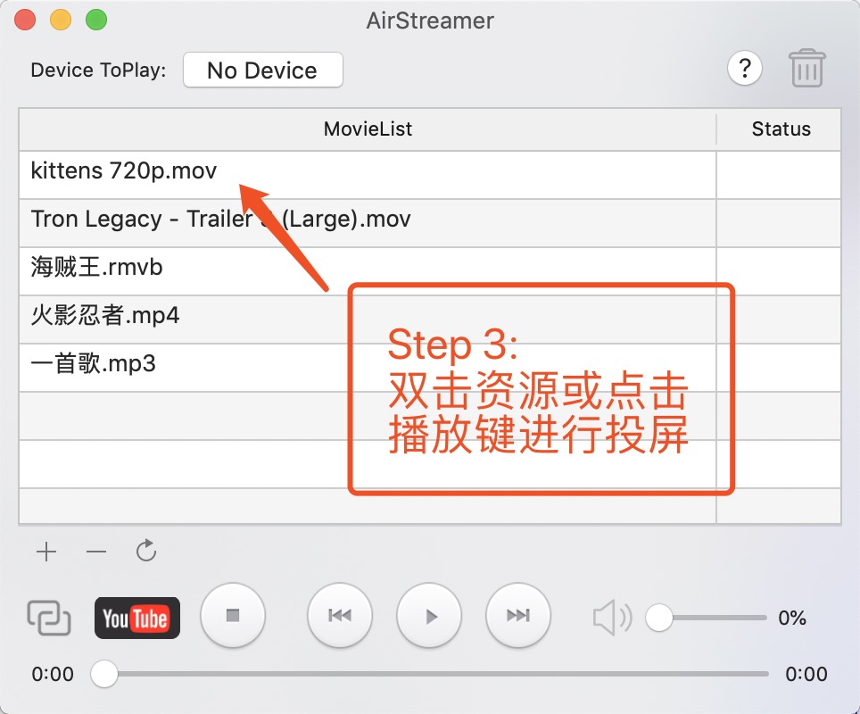

# 无线投屏大师(AirStreamer) 使用说明

## 操作指南

### 1.环境准备
      (1)Mac设备与小米电视(智能电视盒子)在同一Wifi下.
      (2)小米电视或智能盒子开启DLNA投屏服务(具体电视和盒子 打开方式不同)
      (3)简单验证投屏服务是否开启:用手机打开(腾讯视频,爱奇艺,优酷等)进行投屏 查看能否搜索到,若手机能搜索到，AirStreamer即可搜索到

### 2.操作软件
      (1)打开 无线投屏大师(AirStreamer),看左上角设备选择框是否有设备，软件如果搜索到设备会自动选择，如果没有 则点开No Device按钮
      进行设备搜索
      (2)点击列表的添加按钮 添加视频和音乐，双击资源进行投屏
      (3)想添加视频字幕的请看 "问题答疑 2" 下载 视频和字幕合并软件
      
### 3.图文操作 
 -------------  
 图示:  

## 问题答疑

### 1.搜索不到要投屏的设备怎么办?
      请看“操作指南->1.环境准备”查看环境十分准备好.
      如果依然没有，可能是设备不支持DLNA 通用安卓投屏协议
      如果确认支持的，可以联系 swain6@163.com 进行远程帮助解决您的问题.

### 2.本地有下载好的字幕srt格式的，投视频可以带字幕吗? 

      目前电视和电视盒子的协议不支持带字幕，所以只能视频上面带字幕才可以,下面提供一些方法可以将视频和字幕合成为一个带字幕的视频.
      解决方法:
      (1)使用我制作的视频字幕合并软件  
      请下载[链接](https://pan.baidu.com/s/1h3eIDMnB0AxlJm1u9DXr3Q)
      下载 SubMerger.app 后拖到 应用里面就可以使用了,如果打不开去 系统设置->安全与隐私->AppStore ->仍要打开
      (2)安装终端转换插件
      打开系统终端 “brew install mkvtoolnix” 
      合并视频和字幕命令
      "mkvmerge -o 合成的文件路径.mkv 源视频文件路径.mkv 源视频字幕路径.srt"
      例如:
      mkvmerge -o '/Users/111/Movies/output.mkv' '/Users/111/Movies/inputput.mp4' '/Users/111/Movies/inputput.srt'
   
### 3.为什么投屏了之后,电脑休眠了之后视频断开了呢?
      因为电脑休眠后网络连接断开导致,解决: 系统->能源与节能->设置自动休眠长些时间

### 4.YouTube为什么投屏不了呢?
      需要电脑和电视都可以访问youtobe才能解析并投屏

